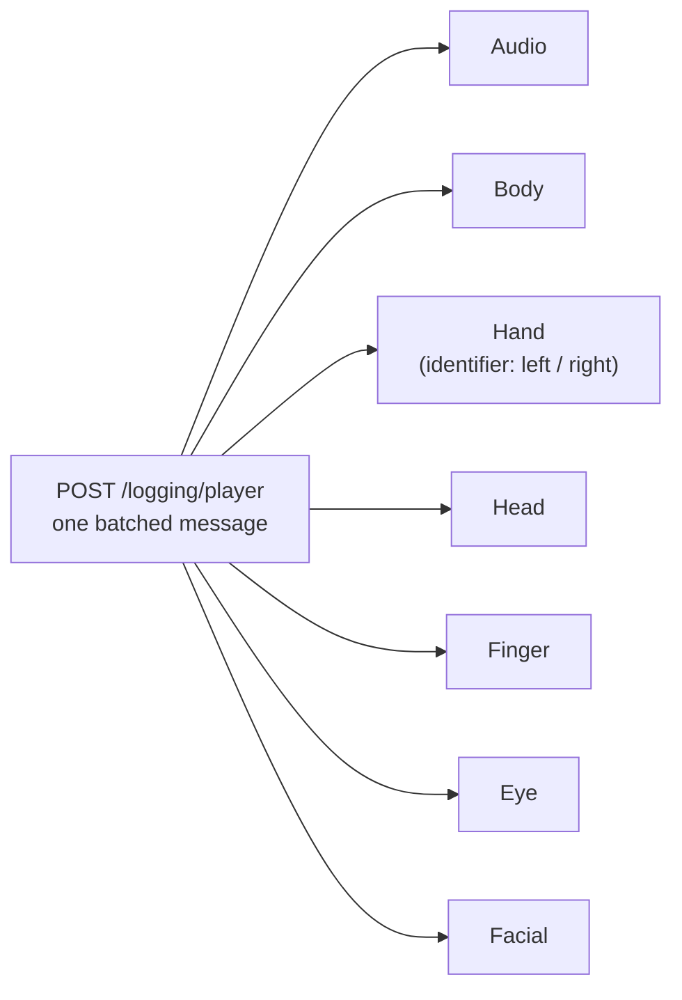

# Database API

The central backend service. Two responsibilities:

1. **Scene data** - serve the scene, level and role definitions the VR client
   loads at startup.
2. **Logging** - accept the continuous stream of tracking samples, events and
   answers an experiment produces, and write it to MongoDB.

Source: `database-api/` · Flask + `flask-restx` · Interactive API docs (Swagger)
are served at the service root.

## Configuration

All configuration is by environment variable.

| Variable | Default | Purpose |
|---|---|---|
| `PORT` | `5000` | Listen port |
| `DB_SERVER` | `localhost` | MongoDB host |
| `DB_PORT` | `27017` | MongoDB port |
| `DB_NAME` | `experiment` | Database name |
| `DB_USERNAME` | `user_rw` | MongoDB user |
| `DB_PASSWORD` | `password` | MongoDB password |
| `X_API_KEY` | *(empty)* | Shared secret required by every endpoint |

!!! danger "The defaults are not safe to deploy"
    `X_API_KEY` defaults to the **empty string**. Since authentication compares
    the request header against that value, leaving it unset means a request that
    sends no key at all - or an empty one - is accepted. Always set it explicitly.

    The database credentials also have committed defaults (`user_rw` /
    `password`) which are visible in the source. Override every one of them per
    deployment; none of the defaults above should survive into a running
    service.

## Authentication

Every endpoint expects a shared secret in a header:

```
X-API-KEY: <value of X_API_KEY>
```

A mismatch returns `401 Unauthorized`.

!!! warning "Authentication failures are invisible to the client"
    Clients do not stop an experiment when logging fails. A wrong key produces a
    session that runs perfectly and records **nothing**. Verify that data is
    arriving before a participant sits down, not after.

    ```bash
    curl -s -o /dev/null -w "%{http_code}\n" \
         -H "X-API-KEY: $X_API_KEY" http://localhost:5000/logging/status
    ```

## Logging endpoints

Namespace `/logging`.

| Endpoint | Purpose |
|---|---|
| `POST /logging/player` | **The main tracking endpoint.** A batched multimodal sample - see below |
| `POST /logging/object` | Object state and interaction (grab, release, hand used) |
| `POST /logging/special` | Free-form structured payload |
| `POST /logging/log` | General log entry |
| `POST /logging/playerLogIn` | Session start for a player |
| `POST /logging/playerRoleLogIn` | Role assignment |
| `POST /logging/levelChange` | Level or scene transition, with status |
| `POST /logging/logMisc` | Miscellaneous events |
| `GET /logging/status` | Health check |

### `POST /logging/player`

One request carries a **batch** of samples across every tracked modality, and the
API fans it out into separate MongoDB collections. This is the single most
important thing to understand about the data model.

Required top-level fields:

```
playerId, audioData, localTime, messageId, body, leftHand, rightHand
```

The request is rejected with `415` if any is missing.



- `body.positions` / `body.rotations` → **Body**
- `body.cameraPositions` / `body.cameraRotations` → **Head**
- `leftHand` / `rightHand` → **Hand**, one document per side, distinguished by
  the `identifier` field
- `audioData.base64` → **Audio**

!!! note "Finger, eye and facial data are conditional"
    They are written **only if the payload contains a `metaMessage` field**. A
    client that does not send it produces a session with body and hand tracking
    but no finger, eye or face data - with no error and nothing in the logs to
    say so. If those collections are unexpectedly empty, check the client's
    payload before looking anywhere else.

Each emitted document carries `playerId`, `messageId`, `localTime`, `counter`
and a server-assigned `serverTime`. See [Data Model](data_model.md#timestamps).

## Scene endpoints

Namespace `/` (root). Stored in the `scenarios` and `globalInfos` collections.

| Endpoint | Methods | Purpose |
|---|---|---|
| `/scene` | `GET` `POST` `PATCH` | One scene - its `name`, `shortName`, `enabled`, `author`, `internalName` |
| `/scenes` | `GET` | List scenes (`?disabled` includes disabled ones, `?small` omits roles) |
| `/role` | `GET` `POST` `PATCH` | One role on a scene |
| `/roles` | `GET` | List a scene's roles |
| `/role/locales` | `POST` `PATCH` | A role's localised name and description |
| `/level` | `GET` `POST` `PATCH` | One level on a scene |
| `/levels` | `GET` | List a scene's levels |
| `/level/locales` | `POST` `PATCH` | A level's localised per-role description |
| `/info` | `GET` | Global information - **deprecated, will be removed** |

All writes (`POST`/`PATCH`) require the `X-API-KEY` header; reads on `/scene`,
`/scenes`, `/roles` and `/levels` do not.

### Creating a scene

Scenes can be built up entirely through this API - no direct MongoDB access is
needed. This is the same structure the Unity client and the manual
`scenarios-languages` collection entries have always used; the API just gives
you a safe way to write it instead of hand-editing MongoDB. See
[Adding Scenes](https://texttechnologylab.github.io/Va.Si.Li-Lab/getting_started/adding_scenes/)
for the concept and the full field reference.

The shape: a **scene** has **roles** (who can join, and how) and **levels** (the
scenario's stages). Each role and level gets **locales** - per-language strings
shown to the player. Build it in that order, since each step below references
the scene's `_id` from the first response.

**1. Create the scene.**

```bash
curl -X POST "$API/scene" -H "X-API-KEY: $KEY" -H "Content-Type: application/json" -d '{
    "name": "Praktikum Experiment 3",
    "shortName": "Praktikum 3",
    "author": "Jane Doe",
    "internalName": "PraktikumScenario03",
    "enabled": true
}'
# -> {"status": "success", "message": "<scene id>"}
ID=<scene id from the response above>
```

**2. Add each role**, one call per role. `identifier` is your own key for the
role (used to reference it in later calls, and in `roleDescriptions` below) - it
is a query parameter, not part of the body.

```bash
curl -X POST "$API/role?id=$ID&identifier=guide" -H "X-API-KEY: $KEY" -H "Content-Type: application/json" -d '{
    "mode": "player",
    "spawnPosition": "P1",
    "maxCount": 1,
    "admin": true,
    "restrictions": []
}'
```

**3. Add each level**, one call per level, in play order.

```bash
curl -X POST "$API/level?id=$ID" -H "X-API-KEY: $KEY" -H "Content-Type: application/json" -d '{
    "id": 1,
    "delay": null
}'
```

!!! warning "The level index is implicit"
    `POST /level` appends to the scene's `levels` array and does not return the
    resulting position. Track it yourself - it is 0 for the first level you add,
    1 for the second, and so on. That index is what `level_index` in the next
    step refers to, not the level's own `id` field.

**4. Add locales.** A role's display name and description:

```bash
curl -X POST "$API/role/locales?id=$ID&identifier=guide&locale=EN" -H "X-API-KEY: $KEY" -H "Content-Type: application/json" -d '{
    "name": "Guide",
    "description": ["Leads the tour and answers questions."]
}'
```

And a level's per-role description (`level_index` is the position from step 3,
`role` is the role identifier from step 2):

```bash
curl -X POST "$API/level/locales?id=$ID&level_index=0&role=guide&locale=EN" -H "X-API-KEY: $KEY" -H "Content-Type: application/json" -d '{
    "description": ["Explain the tour route."]
}'
```

Repeat per locale for every role and level. `POST` on `/role/locales` and
`/level/locales` refuses to overwrite an existing locale (`412 Precondition
Failed`) - use `PATCH` for that instead.

**5. Verify.**

```bash
curl "$API/scene?id=$ID" | python3 -m json.tool
```

!!! note "Making it visible"
    A scene only appears in the client's scene selector once `enabled` is
    `true` and it has the roles and levels a player needs to actually join and
    play it. `PATCH /scene?id=$ID` flips `enabled` without touching anything
    else.

## Running

=== "Docker"

    ```bash
    cd database-api
    docker build -t vasili/database-api .
    docker run -d --restart unless-stopped -p 5000:5000 \
        -e DB_SERVER=mongo.example.org \
        -e DB_NAME=experiment \
        -e DB_USERNAME=<user> \
        -e DB_PASSWORD=<password> \
        -e X_API_KEY=<secret> \
        vasili/database-api
    ```

=== "Locally"

    ```bash
    cd database-api
    pip install -r requirements.txt
    export DB_SERVER=localhost X_API_KEY=<secret>
    python database_api.py
    ```

A `docker-compose.yml` reading from a `.env` file is included in the module
directory.

## Unity client

Point the Va.Si.Li API asset `host` at this service and set the same
`X_API_KEY`. See the
[Va.Si.Li-Lab documentation](https://texttechnologylab.github.io/Va.Si.Li-Lab/).
