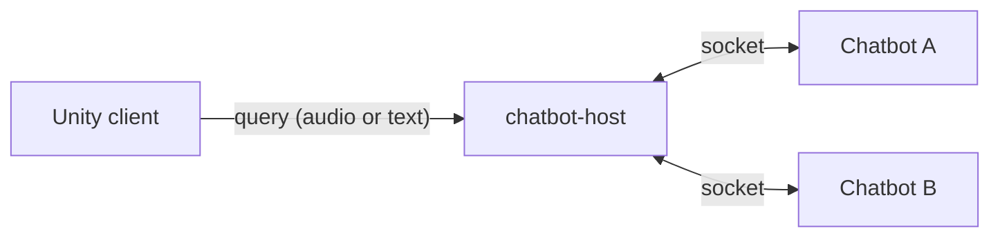

# Chatbot

Optional. A host process that dynamically loads chatbot clients and exposes them
as a single queryable endpoint. Clients connect to the host over a socket, so
bots can be added or removed without restarting the host or reconfiguring
callers.

Source: `chatbot/`

## How it works



The host owns the endpoint; each bot is a separate process that registers itself.
The caller selects which bot to query.

Bot implementations, with their own Dockerfiles, live in `chatbot/chatbots/`.

## Configuration

| Variable | Default | Purpose |
|---|---|---|
| `PORT` | `5000` | Listen port |
| `HOST` | `0.0.0.0` | Bind address |
| `SOCKET_SECRET` | `reallyGoodSecret!` | Shared secret bots authenticate with |
| `MAX_HTTP_BUFFER_SIZE` | `20000000` | Maximum request size in bytes |
| `DEBUG` | `False` | Debug mode |

!!! danger "Change `SOCKET_SECRET`"
    It has a committed default. Anything that can reach the socket and knows that
    default can register itself as a bot and receive queries.

!!! note "`MAX_HTTP_BUFFER_SIZE` exists because queries carry audio"
    Requests can contain base64-encoded audio, which is large. If queries fail on
    long utterances but succeed on short ones, this limit is the first thing to
    check.

## Running

```bash
cd chatbot
python chatbot-host.py
# then start each chatbot client you want available
```

A `docker-compose.yml` is included in the module directory.
